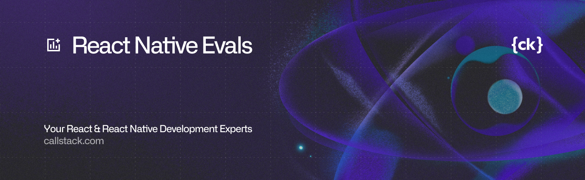

A benchmark suite for evaluating how coding models solve real React Native tasks.

## Available Evals

Groups map to top-level folders under `evals/`.

| Group | Path | Status |
| --- | --- | --- |
| animation | `evals/animation` | Active |
| async-state | `evals/async-state` | Active | 
| navigation | `evals/navigation` | Active |
| react-native-apis | `evals/react-native-apis` | WIP |
| expo-sdk | `evals/expo-sdk` | WIP |
| nitro-modules | `evals/nitro-modules` | WIP |
| lists | `evals/lists` | WIP |

> Want a group that is not listed here? [Open an issue](https://github.com/callstackincubator/evals/issues/new/choose) to request it. Contributions are also welcome.

## Getting Started

```bash
bun install
bun runner/run.ts --model openai/gpt-4.1-mini --output generated/my-generated
bun runner/judge.ts --model openai/gpt-5.3-codex --input generated/my-generated
```

For full command reference and workflows, see [docs](./docs) and [CONTRIBUTING.md](./CONTRIBUTING.md).

## Whitepaper

Methodology and scoring details are documented in the [benchmark methodology whitepaper](./paper/benchmark-methodology-whitepaper.tex).

The benchmark evaluates model-generated React Native implementations using requirement-based assessment. Each eval specifies a fixed task context and a set of explicit, judgeable requirements. Model outputs are judged against these requirements using file-level evidence, and per-eval scores are computed from requirement outcomes with optional weighting. Aggregate run metrics summarize performance across evals under a consistent evaluation protocol.

## Requests And Contributions

If you want to request new features to be evaluated, [open an issue](https://github.com/callstackincubator/evals/issues/new/choose). We are open to covering the most popular ecosystem libraries and will continue expanding coverage.

Contributions are welcome. Start with [CONTRIBUTING.md](./CONTRIBUTING.md) and [`AGENTS.md`](./AGENTS.md).

## License

MIT (`LICENSE`)
